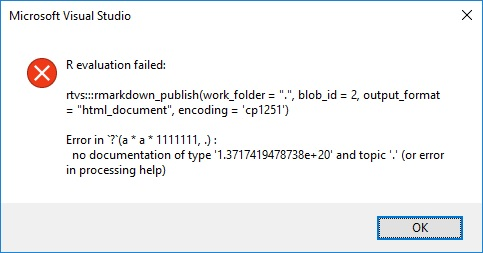

**Цель работы:** на предоставленных задачах освоить азы языка R и среды для его выполнения ~~Rstudio~~ Visual Studio

### Задание 1
Посчитать:

*    35 + 777
*    13 * 47
*    675 * 15
*    849 * 629

```{r}
35 + 777
13 * 47
675 * 15
849 * 629
```


### Задание 2
Умножьте 11111111 само на себя. Теперь умножьте на 1111111?. О чём говрит ошибка?

```{r}
a <- 11111111
a * a * 1111111#?.
```

Возникает ошибка при компиляции, которая не имеет представления что делать с "?"


### Задание 3
Найдите площади примоугольников с длинами (3,7,12,15,20) и ширинами (2,5,8,11,15)

```{r}
recArea <- function(a, b) {
    S <- a * b
    return(S)
}

lnVect <- c(3, 7, 12, 15, 20)
wdVect <- c(2, 5, 8, 11, 15)
recArea(lnVect, wdVect)
```

Для нахождения площади прямоугольника была использована формула: $S = a * b$, где *a* - высота прямоугольника, *b* - его длина

### Задание 4
Постройте график этих длин и ширин

```{r}
plot(wdVect, lnVect, type = "p", xlab = "width", ylab = "length", main = "Rectangle dimensions", bg = "black", pch = 21)
```

### Задание 5
Первокурсник Вася тратит очень мног овремени на домашнюю работу. 40 минут на математику, 40 на английский, 10 на физкультуру и 150 минут на программирование. Постройте график.

```{r}
timeBar <- c("Math" = 40, "English" = 40, "PE" = 10, "Programming" = 150)
barplot(timeBar, main = "Vasya's timetable", xlab = "hours", pch = "x")
```

### Задание 6
Напитки разливаются вручную в банки по 455 мл, количество налитого нормально распределено со средним значением 450 мл. и стандартным отклонением 4 мл. Смоделируйте разливание в 10000 бутылок и расчитайте вероятность переливания банки.

```{r}
n <- 10 ^ 4
rule <- 455
drinks <- rnorm(n, mean = 450, sd = 4)
print(paste("Chance of overfill: ", mean(drinks > 455) * 100, "%"))
```

# Заключение

В ходе выполнения данной работы я получил незабываемый опыт и приобрел навыки, которые пригодятся в дальнейшей профессиональной деятельности. Были изучены и закреплены на практике основы R, а также навыки создания и оформления отчетов.

***

С уважением,

студент гр. РИ-440005

Кабанов Евгений